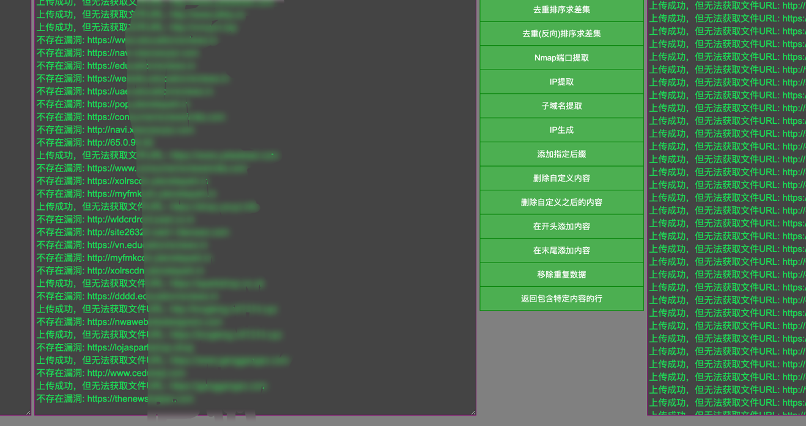

# 资产文本清洗工具 🧹


一个强大而简洁的网络资产文本处理工具,专为安全研究人员和网络管理员设计。

## 🌟 特性

- 📊 去重排序与差集计算
- 🔍 IP地址和子域名提取
- 🖧 Nmap扫描结果处理
- 🔢 IP地址范围生成
- ✏️ 文本自定义编辑(添加/删除内容)
- 🔄 重复数据移除
- 🔎 特定内容筛选

## 🚀 快速开始

1. 克隆仓库:
   ```
   git clone https://github.com/ArrestX/DisPose.git
   ```
2. 打开 `index.html` 文件在您的浏览器中。
3. 开始使用各种文本处理功能!

## 💡 使用说明

1. 在左侧文本框输入您要处理的文本。
2. 选择右侧按钮中的所需功能。
3. 根据提示输入必要的参数(如有)。
4. 在右侧文本框查看处理结果。

## 🛠 主要功能

- **去重排序求差集**: 对比两组数据,找出差异。
- **IP提取**: 从文本中提取所有IP地址。
- **子域名提取**: 提取文本中的所有子域名。
- **Nmap端口提取**: 处理Nmap扫描结果,生成URL列表。
- **IP生成**: 根据给定范围生成IP地址列表。
- **添加/删除内容**: 在文本的开头、结尾或指定位置添加或删除内容。
- **移除重复数据**: 去除文本中的重复行。
- **筛选特定内容**: 返回包含指定内容的行。

## 📷 界面


## 🤝 贡献

欢迎提交问题和改进建议!如果您想为这个项目做出贡献,请遵循以下步骤:

1. Fork 本仓库
2. 创建您的特性分支 (`git checkout -b feature/AmazingFeature`)
3. 提交您的更改 (`git commit -m 'Add some AmazingFeature'`)
4. 推送到分支 (`git push origin feature/AmazingFeature`)
5. 开启一个 Pull Request

## 📄 许可证

本项目采用 MIT 许可证 - 查看 [LICENSE](LICENSE) 文件了解详情


⭐️ 如果您觉得这个工具有用,请给它一个star!